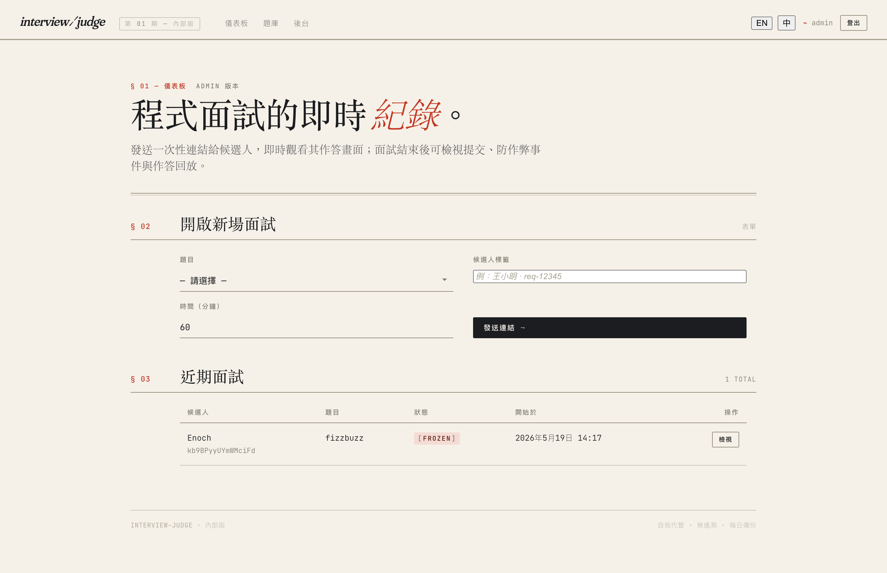
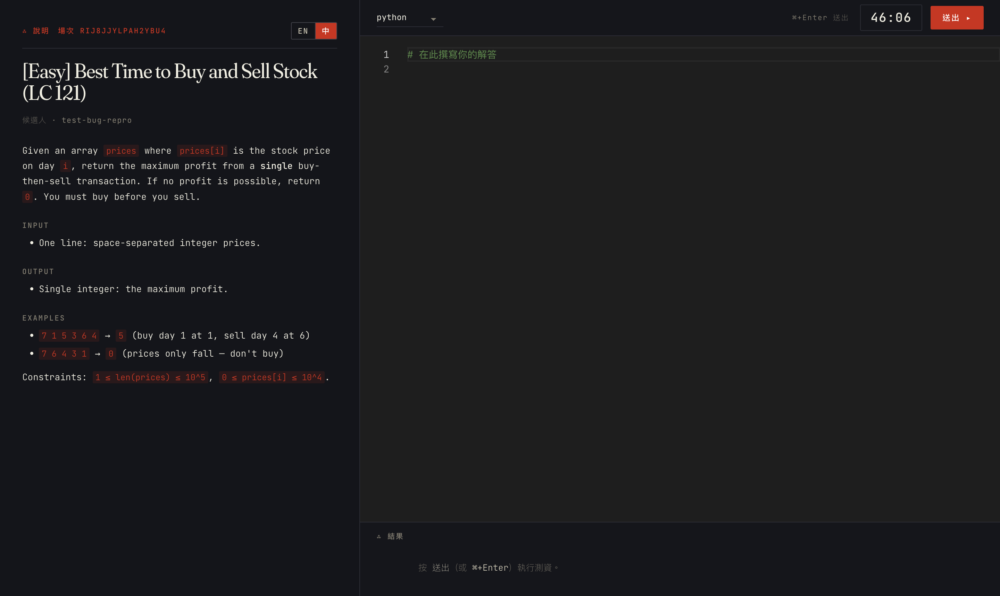
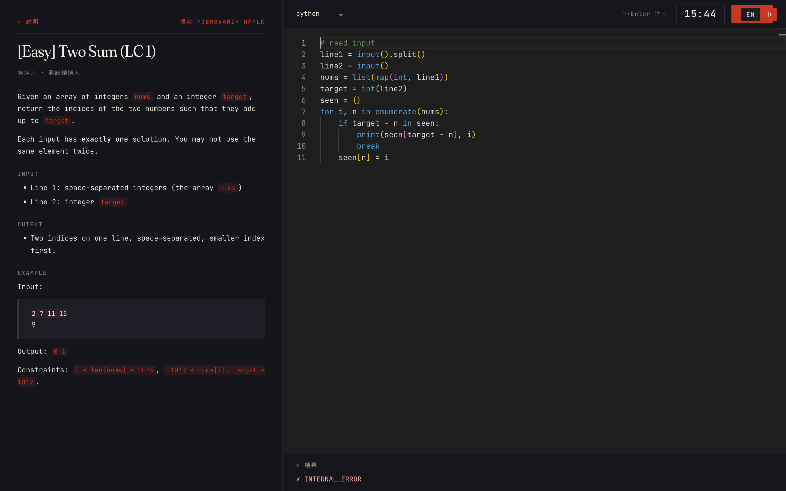
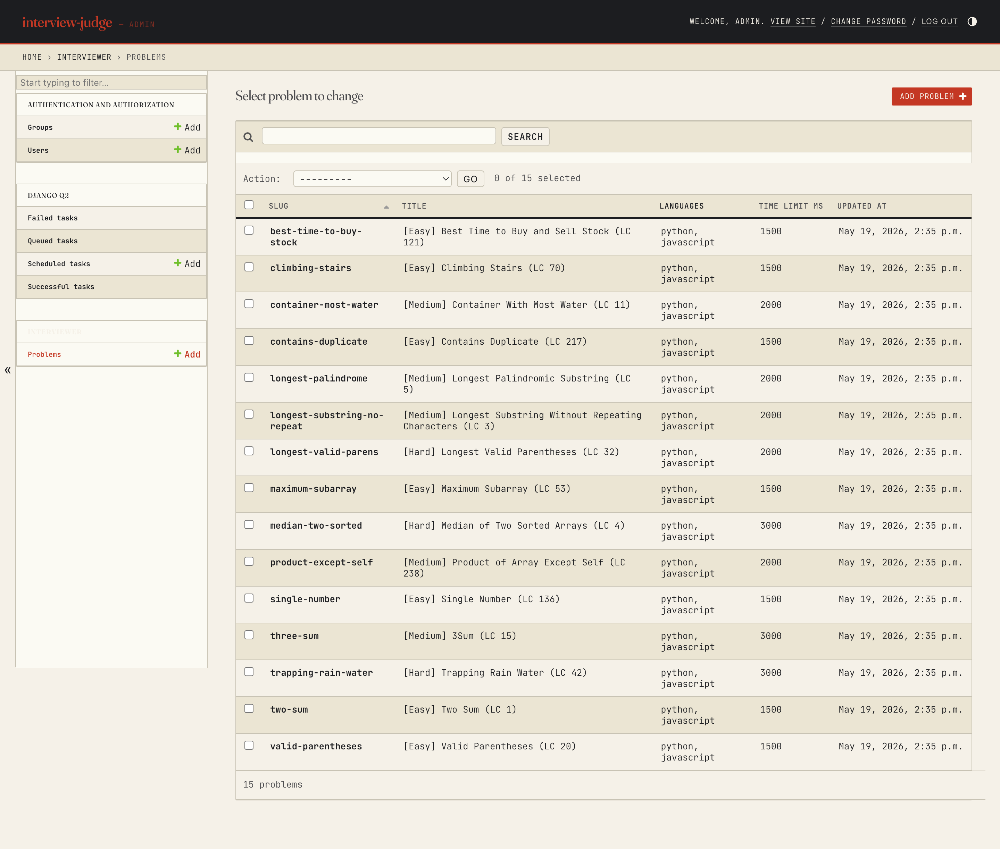
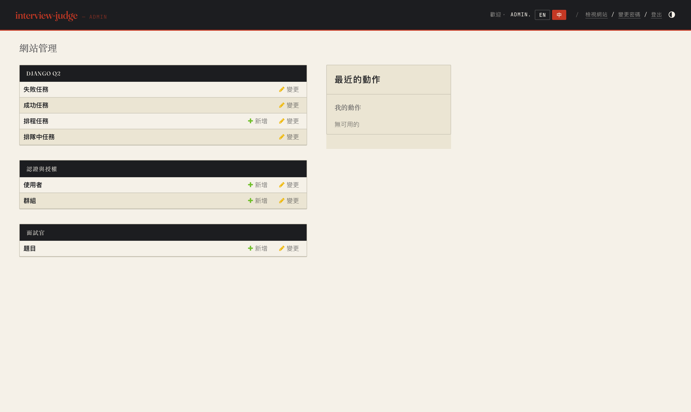

# Galley

Internal coding-interview platform — code is drafted, executed, and reviewed in
a sandboxed workspace. Self-hosted on company LAN, no third-party SaaS.

> *galley* — printer's proof + ship's / kitchen's workstation. A draft passes
> through here before it ships.

> Status: Phase 1–13 complete (Steps 1–13 of 14). Chaos soak passed (5/5).
> Only Step 14 — real-candidate pilot — remains. See [project tracking note](../../zettelkasten/4-project/).



## Quickstart

```bash
cp .env.example .env
make up               # docker compose up everything (web/scheduler/db/redis x2/judge0 x4/nginx/pgdump)
make migrate
make createsuperuser
make seed             # load 15 canonical LeetCode problems
```

Open:
- **Interviewer**: http://localhost:8000/dashboard/ (also /admin/)
- **Health**: http://localhost:8000/healthz · `/readyz`
- **nginx WSS** (prod-style): http://localhost:8080

## Walkthrough — running an interview

### 1. Open the dashboard

Go to `http://localhost:8000/dashboard/`. The form at *§ 02* is where every
interview starts: pick a problem, label the candidate (for your own records,
the candidate never sees it), set the duration.


### 2. Issue a token URL

Click **發送連結 ⤳** (or **Issue token URL ⤳** in EN). A vermillion notice
appears with a single-use URL that expires in 24 h. Copy and send it to the
candidate via Slack / email / whatever channel you trust.

### 3. Candidate enters the session

When the candidate opens the URL, it is consumed (one shot, not forwardable),
a signed cookie is dropped, and they land in the coding stage: problem
statement on the left, Monaco editor on the right, countdown top-right.
EN / 中 toggle sits in the brief eyebrow so it doesn't collide with the
submit button.



If they reload, close the tab, or their Wi-Fi blips, the cookie carries them
back — capped at 3 re-entries per session. Token replay attempts (forwarding
the original URL after consumption) are rejected.

### 4. Observe live (optional)

From the dashboard *Recent sessions* row, click **觀看 / Observe**. You see
their editor content streamed via WebSocket (5 s snapshot cadence, durable
across web container restarts).

### 5. Candidate submits

Pressing **送出 ▸** (or ⌘+Enter) ships the code to Judge0. The verdict —
plus per-testcase results for *example* testcases — appears in the result
pane. Hidden testcases never leak stdin/stdout (security invariant).



### 6. Review after the session

From the dashboard, click **檢視 / Review**. You get:
- Final submission(s) with verdict + per-testcase breakdown
- Snapshot replay (scrub through the candidate's 5-second snapshots)
- Anti-cheat event log (focus loss, paste, copy)

## Managing the problem library

The Django admin at `/admin/interviewer/problem/` is the source of truth for
problems and testcases. After `make seed` you have 15 canonical LeetCode
problems; add/edit your own here.



Admin is fully i18n'd (EN / 中 toggle top-right):



## What works today

- **Token + Cookie auth**: single-consume admission URL, signed cookie reentry with 3/session rate-limit
- **Live observe**: Channels WebSocket, 5s snapshot persistence, replay via `/snapshots.json`
- **Submission**: real Judge0 adapter (HMAC callback + scheduled poll fallback for callback blackholes)
- **Per-testcase results**: example testcases expose stdout/expected; hidden ones do not (security invariant)
- **i18n**: zh-TW + en, per-problem `title_zh` / `statement_md_zh`, Difficulty enum (Easy/Medium/Hard)
- **Scheduler durability**: django-q2 outside Daphne, countdown re-anchors on restart, auto-submit on deadline
- **Anti-cheat events**: focus-loss, paste, copy logged per session
- **Chaos resilience** (verified by Step 13 soak): survives kill -9 web, redis-channels kill, Judge0 callback blackhole, cookie clear, scheduler kill

## Services

| Container | Role |
|-----------|------|
| `web` | Daphne ASGI :8000 (HTTP + WS) |
| `scheduler` | django-q2 worker (runs OUTSIDE Daphne by design) |
| `db` | Postgres 16 (also stores django-q2 jobstore) |
| `redis-channels` | Channels layer ONLY |
| `nginx` | WSS upgrade + reverse proxy :80 |
| `pgdump` | Daily `pg_dump` cron → `ops/backup/dumps/` |
| `judge0-server` / `judge0-workers` / `redis-judge0` / `db-judge0` | Judge0 self-host stack |

The two redises (`redis-channels` and `redis-judge0`) **must never be shared** —
sharing couples our real-time observation SLO to Judge0's queue depth.

## Architecture

Two layers only:

```
domain/   pure Python — no Django imports
  entities/   Session, Submission, Problem, values (Language, Difficulty, ...)
  ports/      Repository, JudgeClient, Scheduler, LiveBroadcaster, ServerClock (Protocols)
  usecases/   AdmitCandidate, SubmitCode, RecordVerdict, AutoSubmit, ImportProblem, ...

web/      Django project + adapters
  apps/core/         /healthz, middleware
  apps/candidate/    candidate-facing views, consumers, templates
  apps/interviewer/  admin, dashboard, observe consumer, review snapshots API
  apps/judging/      Judge0Client adapter, callback view, repos
  apps/scheduling/   DjangoQScheduler adapter
```

See `domain/README.md` for the layering rationale (Postgres + Judge0 are fixed by
spec → no DTO mapper layer; repos return ORM-typed models behind Protocol).

## Stage map

| Stage | Step range | Status |
|-------|-----------|--------|
| Skeleton + Domain | 1–2 | ✅ done |
| Walking skeleton + Problem CRUD | 3–4 | ✅ done |
| Auth + Scheduler + Live observe | 5–7 | ✅ done |
| Submission + Polish + Soak | 8–13 | ✅ done |
| Pilot | 14 | ⏳ pending (needs real candidate) |

## Acceptance criteria

See `.omx-flow/specs/interview-galley.md` (in zettelkasten). Headline:
**5 consecutive 60-min interviews without incident**. Verified — see soak section.

## Development

```bash
make test         # unit + integration (92/92 unit tests passing)
make lint         # ruff check
make fmt          # ruff format
make logs         # tail web + scheduler logs
make shell        # Django shell
make backup       # manual pg_dump trigger
```

## Soak / chaos drill

The soak harness (`tests/soak/run_5x60_with_chaos.py`) drives a Playwright candidate
through `--sessions` × `--session-duration-min` while injecting one chaos type per
session at mid-session. Five chaos types rotate by index:

| index | chaos | what it verifies |
|-------|-------|------------------|
| 0 | `kill -9 web` | container restart + scheduler reattaches |
| 1 | kill `redis-channels` | Channels reconnect, snapshot durability |
| 2 | blackhole Judge0 callback | scheduled poll fallback fires |
| 3 | clear candidate cookies | reentry rate-limit + token replay rejection |
| 4 | kill `scheduler` | timer doesn't drift, auto-submit not lost |

```bash
# Full endurance + chaos run (~5h wall-clock)
make soak USER=admin PASS=...

# Compressed chaos-recovery run (~1h, skips chaos #0)
make soak USER=admin PASS=... SESSIONS=4 DURATION=15 START_INDEX=1
```

Last verified: 2026-05-22, OVERALL PASS (5/5 chaos types).

## Layout caveat — iCloud Drive

This repo lives under iCloud Drive. iCloud sync may interact with file locks
during builds. If you see `EBUSY` or stale `.pyc` files, pause sync via the
Finder iCloud icon during long-running test or soak runs.
